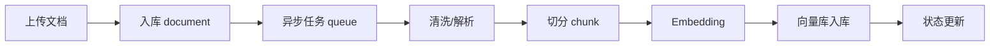
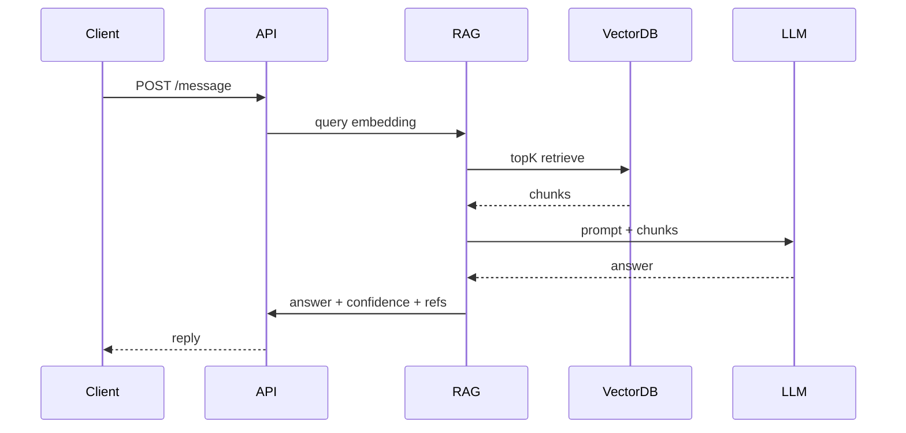

# Architecture — RAGDesk（模块化单体）

> 设计原则：**模块化单体（Modular Monolith）** + 明确边界 + 可演进微服务。核心优先保证“可落地、可解释、可扩展”。

---

## 1. 高层架构

### 1.1 系统组件（逻辑视图）
- **API / HTTP Layer（Kratos HTTP）**
  - 外部 API + 管理后台入口
  - Auth、限流、审计、统一错误码
- **IAM / Tenant**
  - 多租户、用户、角色、权限
- **Knowledge & Ingestion**
  - 文档上传、清洗、分片、版本
  - 异步任务、向量化
- **RAG Engine**
  - Query Embedding → 向量检索 → 重排 → Prompt → LLM
  - 引用来源 + 置信度
- **Conversation**
  - 会话状态机（机器人 → 关闭）
  - 会话与消息记录
- **Analytics**
  - 指标聚合、日报/周报、看板
- **API Management**
  - API Key、配额、QPS、审计
- **Observability**
  - 日志 / Metrics / Trace / 审计

### 1.2 技术基础设施
- **MySQL**：业务核心数据
- **Redis**：会话、限流、缓存、分布式锁
- **向量库**：Qdrant / pgvector
- **消息队列**：异步文档处理 / 统计聚合
- **对象存储**：原始文档 / 处理结果

---

## 2. 组件交互与边界

> 目标：清晰描述“谁调用谁、数据怎么流动、哪些是同步/异步”。

### 2.1 模块职责与交互
- **API Layer**
  - 对外：`/api/v1/*`
  - 管理后台：`/admin/v1/*`
  - 统一鉴权（API Key/JWT）、限流、审计日志
- **IAM / Tenant**
  - 生产/消费 `tenant_id` 上下文
  - 为所有模块提供租户与权限校验能力
- **Knowledge & Ingestion**
  - Admin API 触发上传
  - 写 `document` / `document_version`
  - 异步任务：清洗、切分、向量化、入向量库
- **RAG Engine**
  - 消费 `chat_message` 输入
  - 调用向量库召回 + 可选重排
  - 输出 `answer + refs + confidence`
- **Conversation**
  - 维护会话状态机
  - 会话与消息记录
  - 低置信度时采用保守答复或拒答策略
- **Analytics**
  - 接收事件（会话、召回）
  - 实时指标 + 离线聚合写入日报
- **API Management**
  - Key 生成、配额、限流
  - 调用日志审计
- **Observability**
  - Trace 链路贯穿所有模块
  - 关键操作记录审计日志

### 2.2 同步与异步边界
- **同步路径**：用户请求 → RAG → 回复（要求低延迟）
- **异步路径**：文档处理 / 统计聚合（高吞吐、可重试）

---

## 3. 关键流程

### 3.1 文档处理流程（Ingestion）

### 3.2 对话流程（RAG）

### 3.3 统计分析流程
- 事件写入：会话/消息/召回
- 实时指标：Redis + Prometheus
- 离线聚合：定时作业写入 `analytics_daily`

---

## 4. 系统边界与演进

### 4.1 模块化单体划分
建议按 **领域包/模块** 划分，确保边界清晰：
- `iam`（租户与权限）
- `knowledge`（文档与知识库）
- `rag`（召回与生成）
- `conversation`（会话与消息）
- `analytics`（统计）
- `apimgmt`（API Key 与限流）
- `platform`（系统管理）

### 4.2 未来微服务演进方向
可按吞吐和职责拆分：
- **Doc Processing Service**（异步处理）
- **RAG Service**（高并发推理）
- **Analytics Service**（批处理/流处理）

---

## 5. 安全与隔离设计
- 所有表强制 `tenant_id`
- Query 层统一 `tenant filter`
- API Key + HMAC 签名（可选）
- 限流 / 配额 / 审计日志

---

## 6. 可观测性
- **日志**：请求、响应、错误、审计
- **指标**：QPS、P95、命中率
- **Trace**：对话链路、RAG 召回链路

---

## 7. 部署与可用性
- 单体部署（Docker + k8s）
- Redis / MySQL / VectorDB 独立部署
- 消息队列保障异步任务稳定

---

## 8. SLA 与性能目标
- P95 响应时间 < 2s
- 召回 TopK < 200ms
- 文档处理成功率 > 98%
