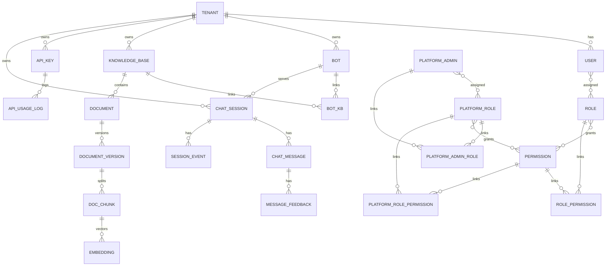

# Data Model — RAGDesk

> 目标：支持多租户、RAG 知识库、会话流转与统计分析。所有租户业务表必须带 `tenant_id`；平台管理员与全局权限表除外。

---

## 1. 核心实体关系（ER 概览）

---

## 2. 表设计（核心字段）

### 2.1 多租户 / 权限
**tenant**
- `id` (PK)
- `name`
- `type` (personal/enterprise)
- `plan` (free/pro/enterprise)
- `status` (active/suspended)
- `created_at`

**user**
- `id` (PK)
- `tenant_id` (FK)
- `email` / `phone`
- `name`
- `status` (active/disabled)
- `created_at`

**role**
- `id` (PK)
- `tenant_id`
- `name`
> 说明：角色为租户级定义。

**permission**
- `id` (PK)
- `code` (string, e.g. `knowledge.read`)
- `description`
- `scope` (platform/tenant)

**user_role**
- `user_id`
- `role_id`

**role_permission**
- `role_id`
- `permission_id`

**platform_admin**
- `id` (PK)
- `email` / `phone`
- `name`
- `status` (active/disabled)
- `password_hash`
- `created_at`

**platform_role**
- `id` (PK)
- `name`

**platform_admin_role**
- `admin_id`
- `role_id`

**platform_role_permission**
- `role_id`
- `permission_id`

**permission seeds（PRD 对齐）**
**platform scope**
- `platform.tenant.create` 创建租户
- `platform.tenant.read` 查询租户
- `platform.tenant.write` 更新租户套餐/状态/配额
- `platform.admin.create` 创建平台管理员
- `platform.admin.read` 查询平台管理员
- `platform.role.write` 创建/更新平台角色
- `platform.role.read` 查询平台角色
- `platform.role.assign` 分配平台角色
- `platform.role.permission.assign` 分配平台角色权限
- `platform.permission.read` 查询权限目录
- `platform.permission.write` 创建权限
- `platform.config.read` 查询平台配置
- `platform.config.write` 更新平台配置

**tenant scope**
- `tenant.user.read` 查询成员
- `tenant.user.write` 创建/更新成员
- `tenant.role.read` 查询角色
- `tenant.role.write` 创建/更新角色
- `tenant.role.assign` 分配角色
- `tenant.role.permission.assign` 分配角色权限
- `tenant.permission.read` 查询租户权限目录
- `tenant.bot.read` 查询机器人
- `tenant.bot.write` 创建/更新机器人
- `tenant.bot.delete` 删除机器人
- `tenant.bot_kb.bind` 绑定知识库
- `tenant.bot_kb.unbind` 解绑知识库
- `tenant.knowledge_base.read` 查询知识库
- `tenant.knowledge_base.write` 创建/更新知识库
- `tenant.knowledge_base.delete` 删除知识库
- `tenant.document.upload` 上传文档
- `tenant.document.read` 查询文档
- `tenant.document.delete` 删除文档
- `tenant.document.reindex` 重新索引
- `tenant.document.rollback` 版本回滚
- `tenant.api_key.read` 查询 API Key
- `tenant.api_key.write` 创建/更新 API Key
- `tenant.api_key.delete` 删除 API Key
- `tenant.api_key.rotate` 轮换 API Key
- `tenant.api_usage.read` 查询 API 调用日志
- `tenant.analytics.read` 查询统计看板
- `tenant.chat_session.read` 查询会话
- `tenant.chat_message.read` 查询消息

---

### 2.2 机器人
**bot**
- `id` (PK)
- `tenant_id`
- `name`
- `description`
- `status` (active/disabled)
- `config_json` (prompt/阈值/策略)

**bot_kb**
- `id` (PK)
- `tenant_id`
- `bot_id`
- `kb_id`
- `weight` (float, optional)
- `created_at`

---

### 2.3 知识库与文档
**knowledge_base**
- `id` (PK)
- `tenant_id`
- `name`
- `description`
- `created_at`
- `updated_at`

**document**
- `id` (PK)
- `tenant_id`
- `kb_id`
- `title`
- `source_type` (pdf/doc/md/url)
- `status` (uploaded/processing/ready/failed)
- `current_version` (int)
- `created_at`
- `updated_at`

**document_version**
- `id` (PK)
- `tenant_id`
- `document_id`
- `version` (int)
- `raw_uri` (必填：`s3://bucket/path`，对象存储 URI)
- `index_config_hash`（chunking + embedding 配置快照，用于变更检测）
- `status` (processing/ready/failed)
- `error_message`
- `created_at`

**doc_chunk**
- `id` (PK)
- `tenant_id`
- `kb_id`
- `document_id`
- `document_version_id`
- `chunk_index`
- `content`
- `token_count`
- `content_hash`
- `language`
- `section` (可选)
- `page_no` (可选)
- `source_uri` (原文来源)
- `created_at`

**embedding**
- `id` (PK)
- `tenant_id`
- `chunk_id`
- `model`
- `created_at`

> `vector` 本体存储在 VectorDB（MVP: Qdrant），MySQL 仅记录 chunk 与 embedding 元信息。

---

### 2.4 会话与消息
**chat_session**
- `id` (PK)
- `tenant_id`
- `bot_id`
- `user_external_id` (对外系统用户 id)
- `status` (bot/closed)
- `close_reason` (optional)
- `metadata` (json/text)
- `created_at`
- `updated_at`
- `closed_at`

**chat_message**
- `id` (PK)
- `tenant_id`
- `session_id`
- `role` (user/assistant)
- `content`
- `confidence`
- `references_json` (引用来源)
- `created_at`

**message_feedback**
- `id` (PK)
- `tenant_id`
- `session_id`
- `message_id`
- `rating` (1/-1)
- `comment` (text, optional)
- `correction` (text, optional)
- `created_at`

**session_event**
- `id` (PK)
- `tenant_id`
- `session_id`
- `event_type` (open/close/refusal)
- `event_detail`
- `created_at`

---

### 2.5 API 管理
**api_key**
- `id` (PK)
- `tenant_id`
- `name`
- `key_hash`
- `status` (active/disabled)
- `quota_daily`
- `qps_limit`
- `created_at`

**api_usage_log**
- `id` (PK)
- `api_key_id`
- `path`
- `status_code`
- `latency_ms`
- `created_at`

---

### 2.6 统计
**analytics_daily**
- `id` (PK)
- `tenant_id`
- `bot_id`
- `date`
- `hit_rate`
- `avg_latency`
- `p95_latency`

---

## 3. 关键索引与约束
- `tenant_id` 必须建联合索引（如 `tenant_id + created_at`）
- `user (tenant_id, email)` 唯一
- `role (tenant_id, name)` 唯一
- `permission (code)` 唯一
- `platform_admin (email)` 唯一
- `platform_role (name)` 唯一
- `bot_id + kb_id` 唯一索引
- `document_id + version` 唯一索引
- `doc_chunk (tenant_id, document_version_id)` 复合索引
- `embedding (tenant_id, chunk_id)` 复合索引
- `message_feedback (tenant_id, message_id)` 复合索引
- `role_permission (role_id, permission_id)` 唯一索引
- `platform_admin_role (admin_id, role_id)` 唯一索引
- `platform_role_permission (role_id, permission_id)` 唯一索引
- `api_key.key_hash` 唯一索引
- 向量库索引：HNSW / IVFFlat
- `chat_session (tenant_id, status)` 用于筛选会话状态

---

## 4. 多租户隔离策略
- **强制 tenant_id filter**：DAO 层必须注入
- **RBAC**：角色-权限映射（租户角色与平台角色分离）
- **平台管理员**：独立账号与角色域，仅访问平台范围权限

---

## 5. 事件埋点建议
- `message_received`
- `rag_hit` / `rag_miss`
- `doc_ingestion_failed`
- `feedback_submitted`
