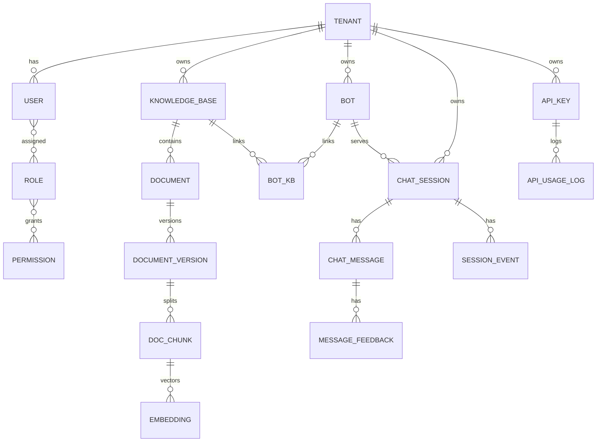

# Data Model — RAGDesk

> 目标：支持多租户、RAG 知识库、会话流转与统计分析。所有核心业务表均必须带 `tenant_id`。

---

## 1. 核心实体关系（ER 概览）

---

## 2. 表设计（核心字段）

### 2.1 多租户 / 权限
**tenant**
- `id` (PK)
- `name`
- `plan` (free/pro/enterprise)
- `status` (active/suspended)
- `created_at`

**user**
- `id` (PK)
- `tenant_id` (FK)
- `email` / `phone`
- `name`
- `status` (active/disabled)
- `created_at`

**role**
- `id` (PK)
- `tenant_id`
- `name`

**permission**
- `id` (PK)
- `code` (string, e.g. `knowledge.read`)

**user_role**
- `user_id`
- `role_id`

---

### 2.2 机器人
**bot**
- `id` (PK)
- `tenant_id`
- `name`
- `description`
- `status` (active/disabled)
- `config_json` (prompt/阈值/策略)

**bot_kb**
- `id` (PK)
- `tenant_id`
- `bot_id`
- `kb_id`
- `priority` (int, optional)
- `weight` (float, optional)
- `created_at`

---

### 2.3 知识库与文档
**knowledge_base**
- `id` (PK)
- `tenant_id`
- `name`
- `description`

**document**
- `id` (PK)
- `tenant_id`
- `kb_id`
- `title`
- `source_type` (pdf/doc/md/url)
- `status` (uploaded/processing/ready/failed)
- `created_at`

**document_version**
- `id` (PK)
- `tenant_id`
- `document_id`
- `version` (int)
- `raw_path` (object storage)
- `parsed_path`
- `created_at`

**doc_chunk**
- `id` (PK)
- `tenant_id`
- `document_version_id`
- `chunk_index`
- `content`
- `tokens`
- `metadata_json`

**embedding**
- `id` (PK)
- `tenant_id`
- `chunk_id`
- `vector` (pgvector)
- `model`
- `created_at`

---

### 2.4 会话与消息
**chat_session**
- `id` (PK)
- `tenant_id`
- `bot_id`
- `user_external_id` (对外系统用户 id)
- `status` (bot/closed)
- `created_at`
- `closed_at`

**chat_message**
- `id` (PK)
- `session_id`
- `sender` (user/bot)
- `content`
- `refs_json` (引用来源)
- `confidence`
- `created_at`

**message_feedback**
- `id` (PK)
- `tenant_id`
- `session_id`
- `message_id`
- `rating` (1/-1)
- `correction` (text, optional)
- `created_at`

**session_event**
- `id` (PK)
- `session_id`
- `event_type` (start/close)
- `payload_json`
- `created_at`

---

### 2.5 API 管理
**api_key**
- `id` (PK)
- `tenant_id`
- `name`
- `key_hash`
- `status` (active/disabled)
- `quota_daily`
- `qps_limit`
- `created_at`

**api_usage_log**
- `id` (PK)
- `api_key_id`
- `path`
- `status_code`
- `latency_ms`
- `created_at`

---

### 2.6 统计
**analytics_daily**
- `id` (PK)
- `tenant_id`
- `bot_id`
- `date`
- `hit_rate`
- `avg_latency`
- `p95_latency`

---

## 3. 关键索引与约束
- `tenant_id` 必须建联合索引（如 `tenant_id + created_at`）
- `bot_id + kb_id` 唯一索引
- `document_id + version` 唯一索引
- `doc_chunk (tenant_id, document_version_id)` 复合索引
- `embedding (tenant_id, chunk_id)` 复合索引
- `message_feedback (tenant_id, message_id)` 复合索引
- `api_key.key_hash` 唯一索引
- 向量库索引：HNSW / IVFFlat
- `chat_session (tenant_id, status)` 用于筛选会话状态

---

## 4. 多租户隔离策略
- **强制 tenant_id filter**：DAO 层必须注入
- **RBAC**：角色-权限映射
- **平台管理员**：只读审计 + 最高权限

---

## 5. 事件埋点建议
- `message_received`
- `rag_hit` / `rag_miss`
- `doc_ingestion_failed`
- `feedback_submitted`
