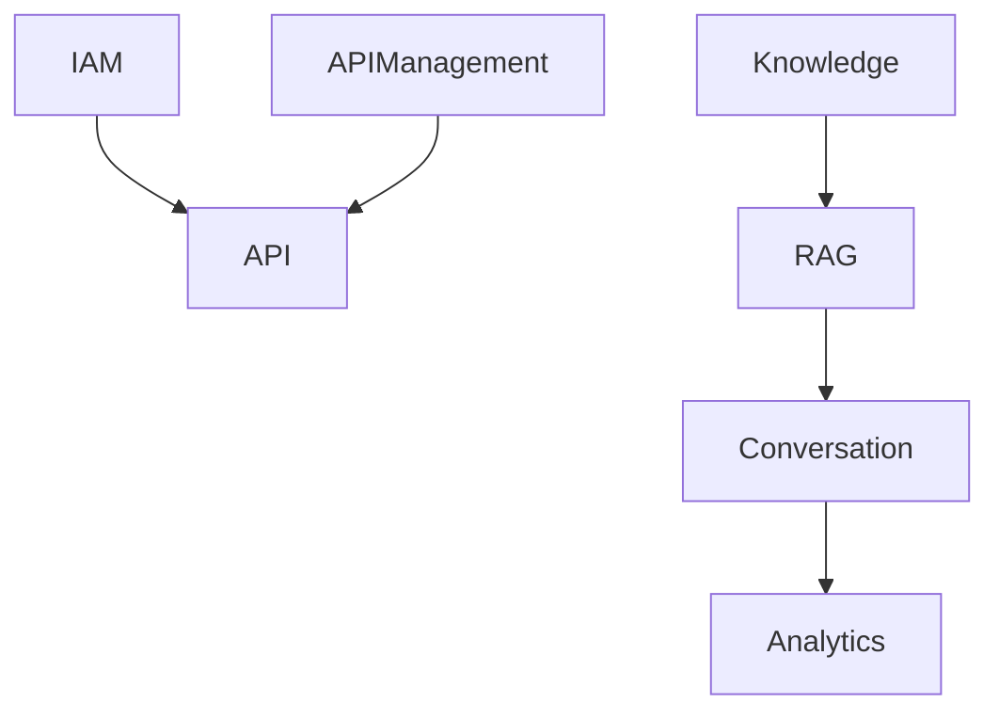

# Modules — RAGDesk

> 模块划分遵循 DDD / Clean Architecture：**接口层 → 应用层 → 领域层 → 基础设施层**。

---

## 1. IAM / Tenant
**职责**
- 企业入驻、成员管理
- 角色与权限（RBAC）
- 租户隔离

**核心能力**
- `TenantService` / `UserService` / `RoleService`
- 权限校验中间件

---

## 2. Knowledge & Ingestion
**职责**
- 文档上传 / 解析 / 清洗 / 分片
- 向量化任务与进度
- 文档版本管理

**核心能力**
- `DocumentService`
- `ChunkingService`
- `EmbeddingService`
- `IngestionJob`

---

## 3. RAG Engine
**职责**
- 查询向量化
- TopK 召回 + 重排
- Prompt 组装 + LLM 调用
- 置信度评估

**核心能力**
- `Retriever`
- `Reranker`（可选）
- `PromptBuilder`
- `LLMClient`
- `ConfidenceScorer`

---

## 4. Conversation
**职责**
- 会话管理
- 消息记录

**核心能力**
- `SessionService`
- `MessageService`

---

## 5. Analytics
**职责**
- 实时指标采集
- 离线聚合（日报/周报）
- 可视化看板

**核心能力**
- `AnalyticsCollector`
- `AnalyticsAggregator`
- `DashboardService`

---

## 6. API Management
**职责**
- API Key 管理
- 配额与限流
- API 调用日志

**核心能力**
- `APIKeyService`
- `QuotaService`
- `UsageLogService`

---

## 7. Platform Admin
**职责**
- 系统级配置
- 租户审计
- 运营监控

---

## 8. Infrastructure
**职责**
- MySQL / Redis / 向量库 / MQ
- 文件存储
- 配置管理
- 统一日志

---

## 9. 模块间关系

---

## 10. 关键跨模块策略
- **Tenant Context** 贯穿所有模块
- **异步任务**：文档处理、统计聚合
- **可观测性**：统一 trace-id
